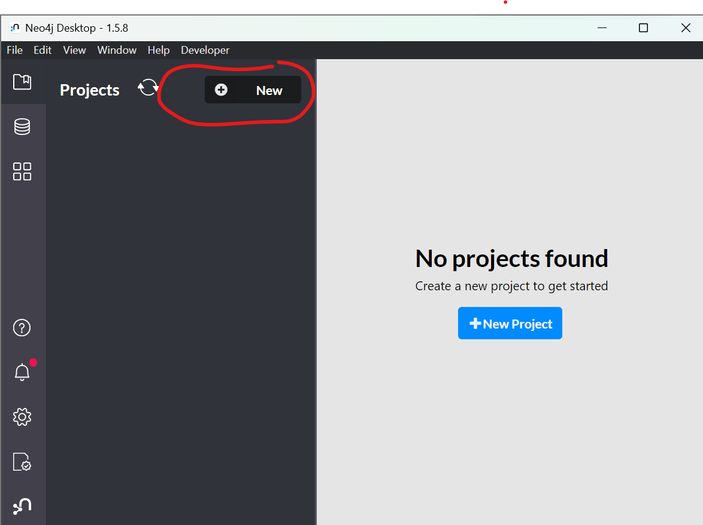
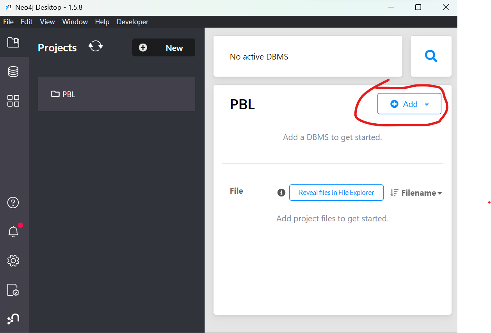
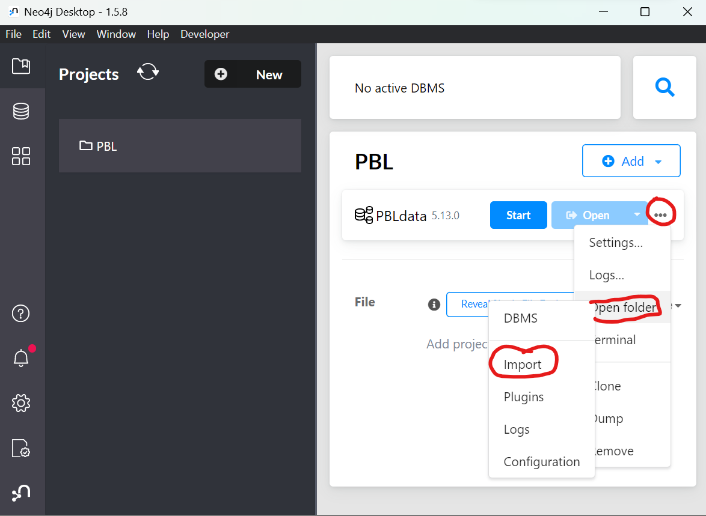
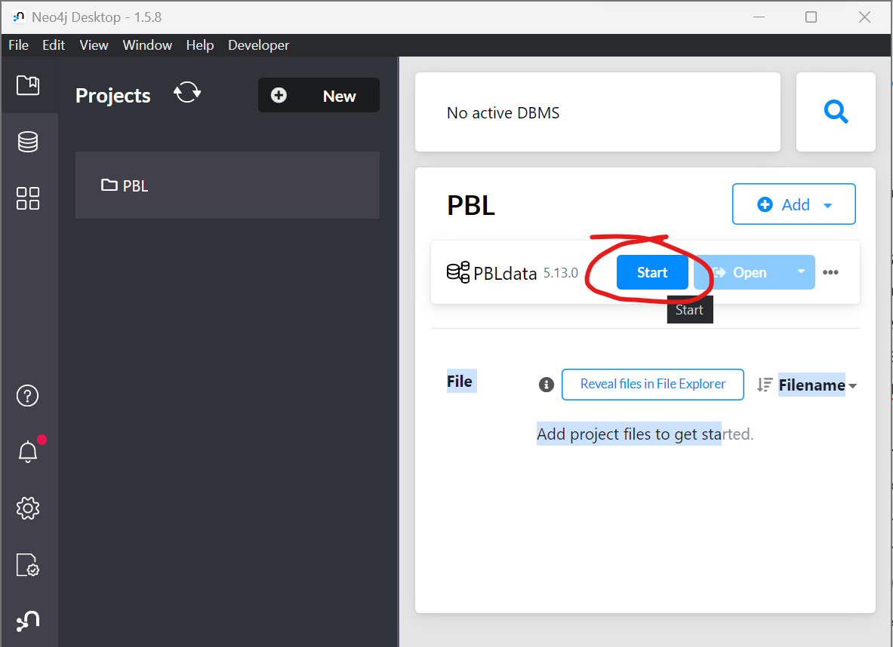
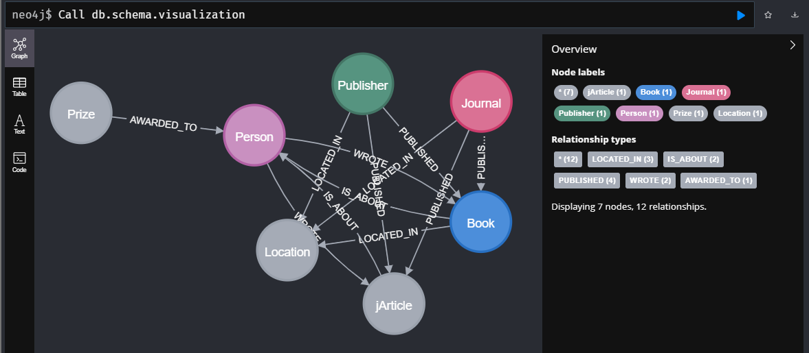
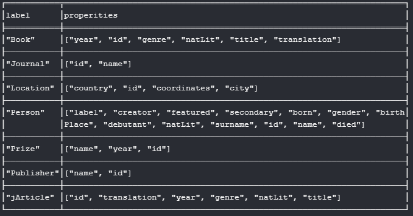

# Data of the Polish Literary Bibliography in neo4j

The resource consists of bibliographic data selected from the ["Polish Literary Bibliography"](https://pbl.ibl.waw.pl/) („Polska Bibliografia Literacka”, PBL). The PBL contains information about literature, theater, and film. The PBL team — the Department of Current Bibliography of the Institute of Literary Research of the Polish Academy of Sciences (Pracownia Bibliografii Bieżącej Instytutu Badań Literackich Polskiej Akademii Nauk) — has been operating in Poznań since 1948. The creator and the first Director of the PBL authors’ team was Professor Stefan Vrtel-Wierczyński. The „Polish Literary Bibliography” documents books published in Poland in Polish and other languages as well as books published abroad in Polish and other languages when they pertain to Polish writers or when their author is Polish. Records of non-literary books on literature are, whenever possible, made by the bibliographer “with the book in the hand” (from autopsy).

## Contributors

**Institute of Literary Research of the Polish Academy of Sciences**, [www.ibl.waw.pl](https://ibl.waw.pl/)

## Resource design
The resource of bibliographic data consists of the following data entities:
- Person, 
- Journal, 
- Journal Article, 
- Book,
- Publisher,
- Location,
- Prize.

And following relations among these entities:
- Article published in a Journal (PublishedJournal),
- Book published by a Publisher (PublishedBook),
- Article or Book written by a Person (Wrote),
- Person awarded in a Prize (Awarded),
- Location of a Publisher, Journal, or printing of the Book (LocatedIn),
- Book or Journal about a Person (IsAbout).

### Data structure
#### Entities
```
Person:
- personId
- name
- surname
- gender (M/F/U)
- born
- died
- birthPlace
- deathPlace
- creator (TRUE/FALSE)
- secondary (TRUE/FALSE)
- debutant (TRUE/FALSE)
Journal (miejsce publikacji)
- journalId
- name
- ISSN
JournalArticle (artykuł przedmiotowy/utwór w czasopiśmie)
- jArticleId
- title
- genre
- issue
- year
- numberOfPages
- type (Literature/Secondary)
Book
- bookId
- title
- year
- genre
- numberOfPages
- type (Literature/Secondary)
Publisher
- publisherId
- name
Location
- locationId
- city
- country
- coordinates
- region
Prize
- prizeId
- name
- year
```
#### Relations
```
PublishedJournal
- jArticleId
- journalId
PublishedBook
- bookId
- publisherId
Wrote
- personId
- bookId / jArticleId
Awarded
- personId
- prizeId
LocatedIn
- publisherId / journalId / bookId
- locationId
IsAbout
- bookId / jArticleId
- personId
```

### Limitations

The „Polish Literary Bibliography” publishing series has been printed since 1954, with 45 annuals published by 2000, containing materials for the years 1944/45–1988.
The printed volumes of the PBL have been digitalized and they are available in the [Digital Repository of Scientific Institutes](https://rcin.org.pl/dlibra/publication/79343).
The online PBL database is limited to data from 1989–2023.

### Statistics

The dataset consists of 1,072,086 Entities and 2,074,321 Relations.

<p align="center">
  
</p>

<p align="center">
  
</p>

## How to use

- Source: [https://github.com/cezary-rosinski/neo4j-MM/blob/main/PBL_entities_relations.7z](https://github.com/cezary-rosinski/neo4j-MM/blob/main/PBL_entities_relations.7z)
- General tutorial on CSV import: [https://neo4j.com/docs/getting-started/cypher-intro/load-csv/ ](https://neo4j.com/docs/getting-started/cypher-intro/load-csv/ )
- Prerequisites: You need to have a desktop neo4j instance installed. Resources can be found here: [https://neo4j.com/docs/desktop-manual/current/installation/](https://neo4j.com/docs/desktop-manual/current/installation/)

### Tutorial
#### STEP1
Follow step 1 of [this tutorial](https://neo4j.com/developer/desktop-csv-import/)
   
   1.1 Create a project (e.g. PBL)
   <p align="center">
     
   </p>
   1.2 Add a database (Local DBMS) within the Project (e.g. PBLdata)
   <p align="center">
     
   </p>
   
#### STEP2
   2.1 Download the dataset from [here](https://github.com/cezary-rosinski/neo4j-MM/blob/main/PBL_entities_relations.7z)
   2.2. Paste the dataset into the import folder
   * Open the import folder
     <p align="center">
       
     </p>
   * Open the archive with the dataset
   * Paste the archive content into the import folder
#### STEP3
   3.1. **Start the local database** (you may need to hoover with the mouse cursor over the database icon so the start button appears)
   <p align="center">
     
   </p>
   
   3.2. **Open Neo4j browser**
   <p align="center">
     
   </p>
   
#### STEP4
In the console window rund the following cypher (you can execute the entire code or go step-by-step, depending on your needs and preferences)
```cypher
//1. Create constraints for nodes, so they are unique
CREATE CONSTRAINT UniquePublisher FOR (publisher:Publisher) REQUIRE publisher.id IS UNIQUE;
CREATE CONSTRAINT UniqueBook FOR (book:Book) REQUIRE book.id IS UNIQUE;
CREATE CONSTRAINT UniquePerson FOR (person:Person) REQUIRE person.id IS UNIQUE;
CREATE CONSTRAINT UniqueJarticle FOR (jArticle:jArticle) REQUIRE jArticle.id IS UNIQUE;
CREATE CONSTRAINT UniqueLocation FOR (location:Location) REQUIRE location.id IS UNIQUE;
CREATE CONSTRAINT UniquePrize FOR (prize:Prize) REQUIRE prize.id IS UNIQUE;
CREATE CONSTRAINT UniqueJournal FOR (journal:Journal) REQUIRE journal.id IS UNIQUE;


//2.Create/Merge nodes
//create publisher nodes
:auto LOAD CSV WITH HEADERS FROM "file:///entities_publisher.csv" AS row
CALL {
WITH row
CREATE (p:Publisher {id: row.publisherId, name: row.name})
}IN TRANSACTIONS OF 100 ROWS;


//create book nodes
:auto LOAD CSV WITH HEADERS FROM "file:///entities_book.csv" AS row
CALL {
WITH row
CREATE (b:Book {id: row.bookId, year: toInteger(row.year), natLit: row.natLit, genre: row.genre, translation: row.translation, title: row.title})
}IN TRANSACTIONS OF 100 ROWS;


//create person nodes
:auto LOAD CSV WITH HEADERS FROM "file:///entities_person.csv" AS row
CALL {
WITH row
MERGE (p:Person {id: row.personId})
ON CREATE SET p.name = row.name, 
              p.surname = row.surname, 
              p.gender = row.gender, 
              p.born = row.born, 
              p.died = row.died, 
              p.birthPlace = row.birthPlace, 
              p.debutant = toBoolean(row.debutant), 
              p.creator = toBoolean(row.creator),
              p.featured = toBoolean(row.featured), 
              p.label = row.label, 
              p.natLit = row.natLit, 
              p.secondary = toBoolean(row.secondary)
} IN TRANSACTIONS OF 100 ROWS;


//create prize nodes
:auto LOAD CSV WITH HEADERS FROM "file:///entities_prize.csv" AS row
CALL {
WITH row
MERGE (p:Prize {id: row.prizeId})
ON CREATE SET p.year = row.year, 
              p.name = row.name 
} IN TRANSACTIONS OF 100 ROWS;


//create journal nodes
:auto LOAD CSV WITH HEADERS FROM "file:///entities_journal.csv" AS row
CALL {
WITH row
MERGE (j:Journal {id: row.journalId})
ON CREATE SET j.name= row.name
} IN TRANSACTIONS OF 100 ROWS;


//create location nodes
:auto LOAD CSV WITH HEADERS FROM 
"file:///entities_location.csv" AS row
CALL {
WITH row
MERGE (l:Location {id: row.locationId})
ON CREATE SET l.city = row.city, 
              l.country = row.country, 
              l.coordinates = row.coordinates
} IN TRANSACTIONS OF 100 ROWS;


//create journal article nodes
:auto LOAD CSV WITH HEADERS FROM "file:///entities_journal_article.csv" AS row
CALL {
WiTH row
CREATE (j:jArticle {id: row.jArticleId, year: toInteger(row.year), natLit: row.natLit, genre: row.genre, translation: row.translation, title: row.title})
} IN TRANSACTIONS OF 100 ROWS;


//3.Create edges
//create edges publisher - LOCATED -> location
:auto LOAD CSV WITH HEADERS FROM 'file:///relations_located_in.csv' AS csvLine
CALL {
 WITH csvLine
 MATCH (publisher:Publisher {id: csvLine.id}), (location:Location {id: csvLine.locationId})
CREATE (publisher)-[:LOCATED_IN]->(location)
} IN TRANSACTIONS OF 100 ROWS;


//create edges journal- LOCATED -> location
:auto LOAD CSV WITH HEADERS FROM 'file:///relations_located_in.csv' AS csvLine
CALL {
 WITH csvLine
 MATCH (journal:Journal{id: csvLine.id}), (location:Location {id: csvLine.locationId})
CREATE (journal)-[:LOCATED_IN]->(location)
} IN TRANSACTIONS OF 100 ROWS;


//create edges book - LOCATED -> location
:auto LOAD CSV WITH HEADERS FROM 'file:///relations_located_in.csv' AS csvLine
CALL {
 WITH csvLine
 MATCH (book:Book{id: csvLine.id}), (location:Location {id: csvLine.locationId})
CREATE (book)-[:LOCATED_IN]->(location)
} IN TRANSACTIONS OF 100 ROWS;


//create edges book - IS_ABOUT -> person 
:auto LOAD CSV WITH HEADERS FROM 'file:///relations_is_about.csv' AS csvLine
CALL {
 WITH csvLine
 MATCH (book:Book{id: csvLine.id}), (person:Person {id: csvLine.personId})
CREATE (book)-[:IS_ABOUT]->(person)
} IN TRANSACTIONS OF 100 ROWS;


//create edges jArcicle- IS_ABOUT -> person - 
:auto LOAD CSV WITH HEADERS FROM 'file:///relations_is_about.csv' AS csvLine
CALL {
 WITH csvLine
 MATCH (jArticle:jArticle{id: csvLine.id}), (person:Person {id: csvLine.personId})
CREATE (jArticle)-[:IS_ABOUT]->(person)
} IN TRANSACTIONS OF 100 ROWS;


//create edges prize - AWARDED_TO -> person
:auto LOAD CSV WITH HEADERS FROM 'file:///relations_was_awarded.csv' AS csvLine
CALL {
 WITH csvLine
 MATCH (prize:Prize{id: csvLine.prizeId}), (person:Person {id: csvLine.personId})
CREATE (prize)-[:AWARDED_TO]->(person)
} IN TRANSACTIONS OF 100 ROWS;


//create edges person - [WROTE] -> book
:auto LOAD CSV WITH HEADERS FROM 'file:///relations_wrote.csv' AS csvLine
CALL {
 WITH csvLine
 MATCH (book:Book{id: csvLine.id}), (person:Person {id: csvLine.personId})
CREATE (person)-[:WROTE]->(book)
} IN TRANSACTIONS OF 100 ROWS;


//create edges person - [WROTE] -> jArticle
:auto LOAD CSV WITH HEADERS FROM 'file:///relations_wrote.csv' AS csvLine
CALL {
 WITH csvLine
 MATCH (jArticle:jArticle{id: csvLine.id}), (person:Person {id: csvLine.personId})
CREATE (person)-[:WROTE]->(jArticle)
} IN TRANSACTIONS OF 100 ROWS;


//create edges journal - PUBLISHED -> jArticle
:auto LOAD CSV WITH HEADERS FROM 'file:///relations_published_journal.csv' AS csvLineJ
CALL {
 WITH csvLineJ
 MATCH (journal:Journal {id: csvLineJ.journalId}), (jArticle:jArticle{id: csvLineJ.jArticleId})
CREATE (journal)-[:PUBLISHED]->(jArticle)
} IN TRANSACTIONS OF 100 ROWS;


//create edges publisher - PUBLISHED -> book
:auto LOAD CSV WITH HEADERS FROM 'file:///relations_published_book.csv' AS csvLineB
CALL {
 WITH csvLineB
 MATCH (publisher:Publisher {id: csvLineB.publisherId}), (book:Book {id: csvLineB.bookId})
CREATE (publisher)-[:PUBLISHED]->(book)
} IN TRANSACTIONS OF 100 ROWS
```
#### STEP5
   5.1. Check your database structure with this query:
   ```cypher
   Call db.schema.visualization
   ```
   It should look like this:
   <p align="center">
     
   </p>
   Please note that empty [PUBLISHED] relationships were falsely created between Journal and Book, as well as between Publisher and jArticle. We are trying to find the bug causing this (if you know, please reach out to us). However, this does not interfere with the data and analysis.
   
   5.2. **Check the nodes**
   * This query lists the unique node types and counts particular nodes:
     ```cypher
     MATCH (n) 
     RETURN labels(n) AS NodeType, count(n) AS NumberOfNodes
     ```
     The result should look like this:
     | NodeType      | NumberOfNodes |
     |---------------|---------------|
     | ["Publisher"] | 33571         |
     | ["Book"]      | 201309        |
     | ["Person"]    | 153215        |
     | ["Prize"]     | 3616          |
     | ["Journal"]   | 2814          |
     | ["Location"]  | 3634          |
     | ["jArticle"]  | 673907        |
  * This query lists nodes and their properties (keys):
    ```cypher
    MATCH (n) WITH LABELS(n) AS labels, KEYS(n) AS keys UNWIND labels AS label 
    UNWIND keys AS key 
    RETURN DISTINCT label, COLLECT(DISTINCT key) AS properties ORDER BY label
    ```
    The result should look like this:
    <p align="center">
     
   </p>
    
  5.3. **Check the edges**
  This query lists the unique relationship types and counts particular relationships:
  ```cypher
  CALL db.relationshipTypes() YIELD relationshipType
  WITH relationshipType
  MATCH ()-[r]->() WHERE type(r) = relationshipType
  RETURN relationshipType as RelationshipType, count(*) as Count 
  ```
  The results should look like this:
  | RelationshipType | Count  |
  |------------------|--------|
  | "LOCATED_IN"     | 213420 |
  | "IS_ABOUT"       | 231843 |
  | "AWARDED_TO"     | 6215   |
  | "WROTE"          | 757773 |
  | "PUBLISHED"      | 871285 |
  
**Congratulations you now have a fully operational dataset.**
     


## Licence

All texts in this collection are in the public domain. No rights reserved, texts are available under Creative Commons Attribution 4.0 International Licence [CC BY 4.0](https://creativecommons.org/licenses/by/4.0/).


